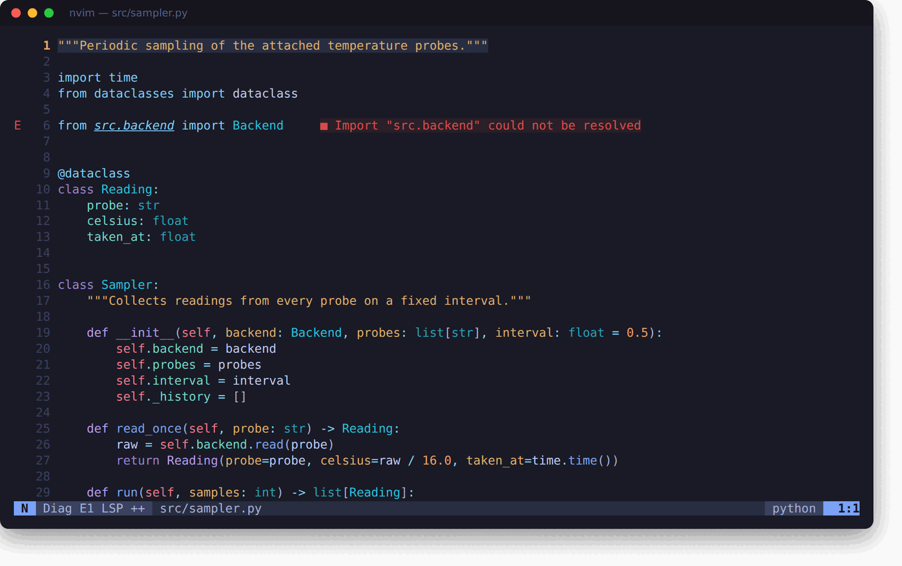
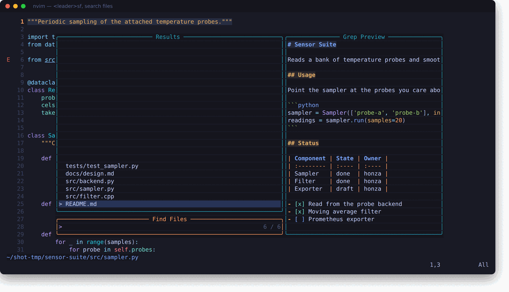
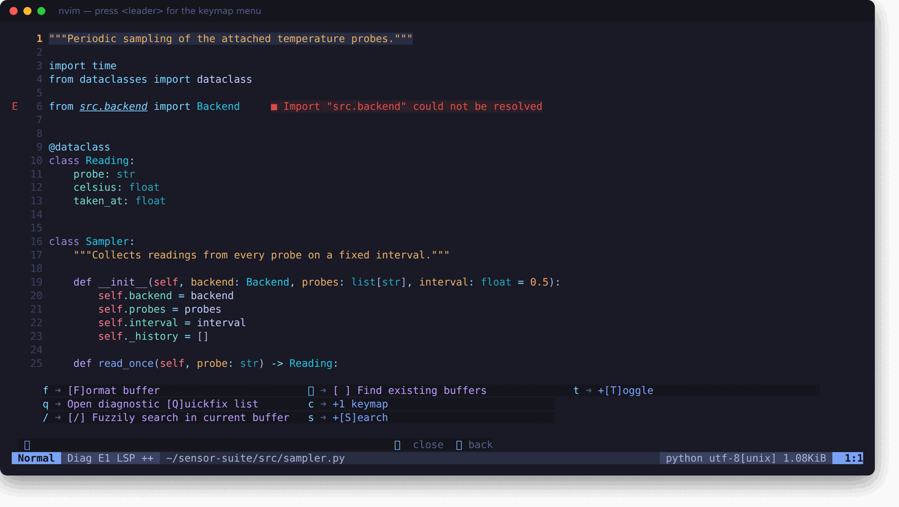
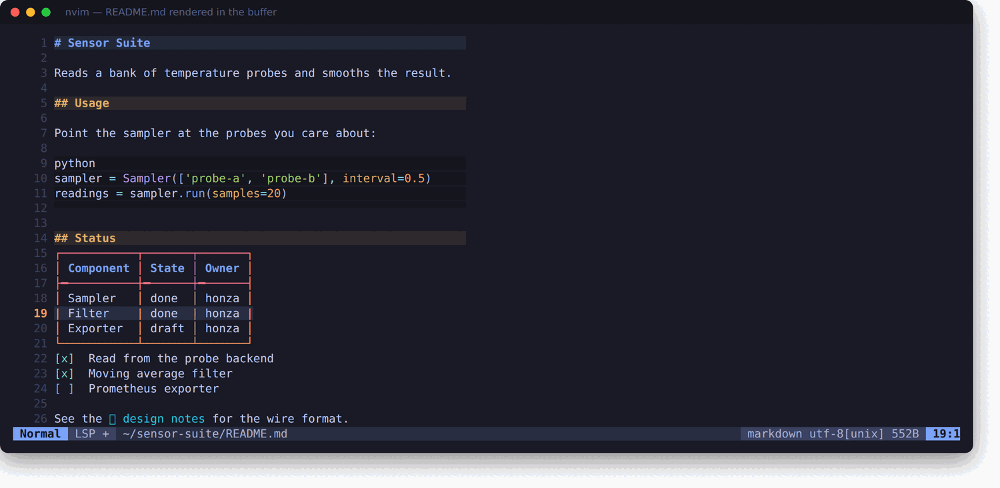
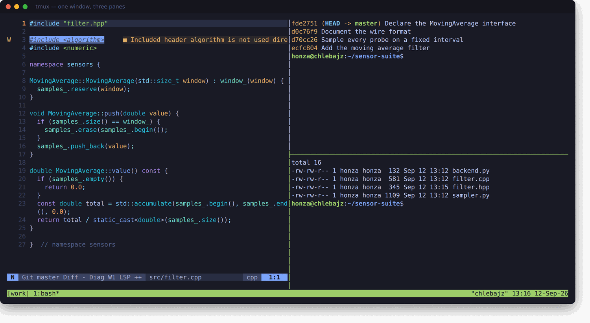

# my_setup

My personal development environment for Ubuntu/Debian: shell, terminal multiplexer
and editor configuration kept in one repository so a fresh machine can be brought
up to the same state with a clone, a script and three symlinks.

This is a dotfiles repository, not a Neovim distribution. The Neovim part started
from [kickstart.nvim](https://github.com/nvim-lua/kickstart.nvim) and the tmux part
from [Oh My Tmux](https://github.com/gpakosz/.tmux); both have been modified.

Every keybinding is written down in the [shortcuts guide](docs/SHORTCUTS.md),
ordered so the keys you need on the first day come first.

## What it looks like

Neovim editing Python. Treesitter colours the syntax, pyright reports an
unresolved import inline, and the statusline carries the error count and the
attached language server.



`<leader>sf` opens the file finder with a live preview of the selected file.
`<leader>sg` does the same for text across the whole project.



Press the leader key and pause. which-key lists everything that starts with it,
so the keymaps are discoverable rather than memorised.



Markdown is drawn inside the buffer as you edit it. The line under the cursor
drops back to raw text so it stays editable.



tmux holding three panes: the editor, a git log and a shell. Alt with the arrow
keys moves between panes, Ctrl with the arrows changes window.



## What is in here

| Path | Contents |
| :--- | :--- |
| `install.sh` | Installs system packages with `apt`, plus Neovim from its official release |
| `config/bash/bashrc` | Shell snippet: auto-attach to tmux, `vim` alias, `:q` to exit |
| `config/tmux/tmux.conf` | Oh My Tmux base configuration, not meant to be edited |
| `config/tmux/tmux.conf.local` | Personal tmux overrides, edit this one |
| `config/nvim/` | Neovim configuration, kickstart based, entry point is `init.lua` |
| `config/nvim/lua/custom/plugins/` | Personal plugin specs: Copilot, CopilotChat, markdown rendering |
| `config/nvim/lua/kickstart/plugins/` | Optional kickstart plugins, enabled from `init.lua` |
| `docs/SHORTCUTS.md` | Every keybinding, most useful first |

## Requirements

Neovim 0.12 or newer. This is not optional: nvim-treesitter installs parsers through
APIs that only exist from that release. The version carried by `apt` is far older, so
`install.sh` fetches the official release binary instead.

`install.sh` covers the system packages. Editor tooling is handled separately by
Mason, which installs into `~/.local/share/nvim/mason` on first launch and never
touches system or global Python packages. Mason provides the language servers
(`clangd`, `pyright`, `lua_ls`), the formatters (`stylua`, `black`, `isort`) and the
`tree-sitter` CLI used to build parsers.

Two things are still left to you:

- `luarocks` for the CopilotChat `make tiktoken` build step
- A [Nerd Font](https://www.nerdfonts.com/) in your terminal if you want icons

## Installation

Clone the repository into your home directory. The paths below assume `~/my_setup`.

```sh
git clone git@github.com:chlebja3/my_setup.git ~/my_setup
cd ~/my_setup
bash install.sh
```

Link the Neovim configuration. Back up or remove any existing `~/.config/nvim` first.

```sh
ln -s ~/my_setup/config/nvim ~/.config/nvim
```

Link the tmux configuration. tmux reads the whole directory, so one link covers both
the base file and your overrides.

```sh
ln -s ~/my_setup/config/tmux ~/.config/tmux
```

Source the shell snippet from your own `~/.bashrc`.

```sh
echo 'source "$HOME/my_setup/config/bash/bashrc"' >> ~/.bashrc
```

Open a new terminal. It attaches to a tmux session called `default`, creating it if
needed. Start `nvim` and lazy.nvim installs every plugin on first launch. Run `:Lazy`
to watch progress and `:checkhealth` afterwards to confirm the setup.

On that very first launch Mason is still downloading the `tree-sitter` CLI while
nvim-treesitter is already trying to build parsers, so a few parsers report a build
error. Quit and start `nvim` again and they build cleanly. This only happens once.

## Neovim

Leader key is `<space>`. `init.lua` is a single documented file, so searching it is
the fastest way to find how something is wired. The keys themselves are in the
[shortcuts guide](docs/SHORTCUTS.md); this section covers how the pieces are set up.

**Language servers**, installed automatically through Mason: `clangd`, `pyright` and
`lua_ls`. Treesitter parsers for bash, c, diff, html, lua, luadoc, markdown, query,
vim and vimdoc are installed up front, and any other language is fetched and built
the first time you open a file of that type. Treesitter also drives indentation,
falling back to Vim's built-in rules for languages with no indent query.

**Formatting** runs on save. Python uses `isort` then `black` and C and C++ use
`clang-format` with `--style=file`, so a `.clang-format` in the project root decides
the style, both through conform.nvim. Lua is formatted by `stylua` running as a
language server rather than through conform, which is why `lua_ls` has its own
formatting switched off. Every other filetype falls back to its language server.
Plain C is the one exception and is never formatted on save. `<leader>f` formats
manually.

**GitHub Copilot** is disabled at startup. `<C-J>` toggles it in normal mode and
accepts a suggestion in insert mode. It is restricted to Python, C++ and Lua buffers.

**CopilotChat** keymaps:

| Key | Mode | Action |
| :-- | :--- | :----- |
| `<leader>cc` | normal | Open the chat window |
| `<leader>cce` | normal | Explain the code |
| `<leader>cct` | visual | Generate tests for the selection |
| `<leader>ccx` | visual | Chat about the selection |

**Markdown** is rendered inside the buffer as you edit it, through
render-markdown.nvim. Headings, code blocks, tables, bullets, checkboxes and
links are drawn in place, while the line under the cursor stays raw so it is
still editable. Press `<leader>tm` in normal mode to toggle rendering off and on.

The icons are deliberately plain characters so they display in any terminal,
because `vim.g.have_nerd_font` is `false`. If you install a Nerd Font, set that
variable to `true` in `init.lua` and delete the `opts` table in
`config/nvim/lua/custom/plugins/render-markdown.lua` to get the nicer default
glyphs. LaTeX rendering is switched off, since it needs a separate parser and
the `utftex` or `latex2text` binary.

**File headers** are inserted automatically into new files. C, C++ and header files
get a Doxygen block with `@file`, `@brief`, author and date. Python files get a
docstring with the same fields. Both live at the bottom of `init.lua`, which is where
you change the name and email.

## tmux

`config/tmux/tmux.conf` is the upstream Oh My Tmux file and should be left alone so it
stays easy to update, which is exactly what makes replacing it with a newer upstream
copy safe. Put every personal change in `config/tmux/tmux.conf.local`. Reload a
running session with `<prefix> r`.

The local overrides are small: vi keys in the status prompt and in copy mode,
`<prefix> t` to open a window in the current directory, Ctrl with the left and right
arrows to change window, Alt with the arrows to change pane, and dropping plugins
that are no longer listed whenever the configuration is reloaded.

Pane and window bindings are listed in the [shortcuts guide](docs/SHORTCUTS.md).

## Customizing

- Neovim plugins: add a file returning a lazy.nvim spec under `config/nvim/lua/custom/plugins/`
- Neovim options and keymaps: edit `config/nvim/init.lua`
- tmux: edit `config/tmux/tmux.conf.local`
- Shell: edit `config/bash/bashrc`

Lua files are formatted with `stylua`, configured in `config/nvim/.stylua.toml`.
Note that `config/nvim/.gitignore` excludes `lazy-lock.json`, so plugin versions are
not pinned across machines. Remove that line if you want reproducible plugin versions.

## Credits

- Neovim configuration based on [kickstart.nvim](https://github.com/nvim-lua/kickstart.nvim)
- tmux configuration based on [Oh My Tmux](https://github.com/gpakosz/.tmux) by Gregory Pakosz

## License

MIT, see [LICENSE.md](LICENSE.md).
